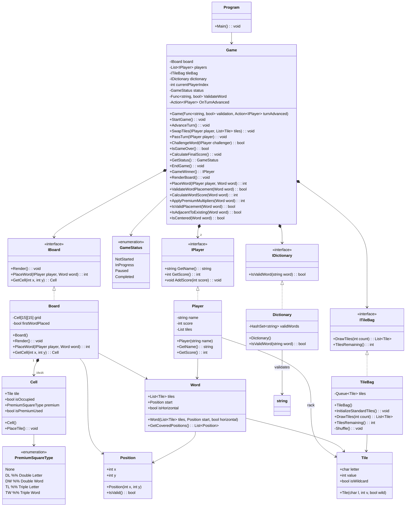

```mermaid 

classDiagram

    class Program {
        +Main() : void
    }

    class Game {
        -IBoard board
        -List~IPlayer~ players
        -ITileBag tileBag
        -IDictionary dictionary
        -int currentPlayerIndex
        -GameStatus status
        -Func~string, bool~ ValidateWord
        -Action~IPlayer~ OnTurnAdvanced
        +Game(Func~string, bool~ validation, Action~IPlayer~ turnAdvanced)
        +StartGame() : void
        +AdvanceTurn() : void
        +SwapTiles(IPlayer player, List~Tile~ tiles) : void
        +PassTurn(IPlayer player) : void
        +ChallengeWord(IPlayer challenger) : bool
        +IsGameOver() : bool
        +CalculateFinalScore() : void
        +GetStatus() : GameStatus
        +EndGame() : void
        +GameWinner() : IPleyer
        +RenderBoard() : void
        +PlaceWord(IPlayer player, Word word) : int
        +ValidateWordPlacement(Word word) : bool
        +CalculateWordScore(Word word) : int
        +ApplyPremiumMultipliers(Word word) : int
        +IsValidPlacement(Word word) : bool
        +IsAdjacentToExisting(Word word) : bool
        +IsCentered(Word word) : bool
    }

    class IBoard {
        <<interface>>
        +Render() : void
        +PlaceWord(IPlayer player, Word word) : int
        +GetCell(int x, int y) : Cell
    }

    class Board {
        -Cell[15][15] grid
        -bool firstWordPlaced
        +Board()
        +Render() : void
        +PlaceWord(IPlayer player, Word word) : int
        +GetCell(int x, int y) : Cell
    }

    class Cell {
        +Tile tile
        +bool isOccupied
        +PremiumSquareType premium
        +bool isPremiumUsed

        +Cell()
        +PlaceTile() : void
    }

    class PremiumSquareType {
        <<enumeration>>
        None
        DL  %% Double Letter
        DW  %% Double Word
        TL  %% Triple Letter
        TW  %% Triple Word
    }

    class GameStatus {
        <<enumeration>>
        NotStarted
        InProgress
        Paused
        Completed
    }

    class IPlayer {
        <<interface>>
        +string GetName() : string
        +int GetScore() : int
        +void AddScore(int score) : void
    }

    class Player {
        -string name
        -int score
        -List<Tile> tiles
        +Player(string name)
        +GetName() : string
        +GetScore() : int
    }

    class Tile {
        +char letter
        +int value
        +bool isWildcard
        +Tile(char l, int v, bool wild)
    }

    class ITileBag {
        <<interface>>
        +DrawTiles(int count) : List~Tile~
        +TilesRemaining() : int
    }

    class TileBag {
        -Queue~Tile~ tiles
        +TileBag()
        +InitializeStandardTiles() : void
        +DrawTiles(int count) : List~Tile~
        +TilesRemaining() : int
        -Shuffle() : void
    }

    class IDictionary {
        <<interface>>
        +IsValidWord(string word) : bool
    }

    class Dictionary {
        -HashSet~string~ validWords
        +Dictionary()
        +IsValidWord(string word) : bool
    }

    class Word {
        +List~Tile~ tiles
        +Position start
        +bool isHorizontal
        +Word(List~Tile~ tiles, Position start, bool horizontal)
        +GetCoveredPositions() : List~Position~
    }

    class Position {
        +int x
        +int y
        +Position(int x, int y)
        +IsValid() : bool
    }

    Program --> Game
    Game *--> IBoard
    Game *--> "2" IPlayer
    Game *--> ITileBag
    Game *--> IDictionary
    Game --> GameStatus

    IBoard <|.. Board

    Board "1" *--> "15x15" Cell
    Board --> Word
    Board --> Position

    IPlayer <|.. Player

    Player --> Tile : rack
    Player --> Word

    Word --> Position
    Word --> Tile

    ITileBag <|.. TileBag
    TileBag --> Tile

    IDictionary <|.. Dictionary
    Dictionary --> string : validates

    Cell --> PremiumSquareType

```